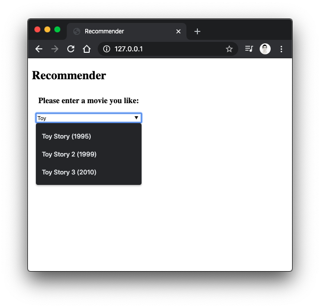
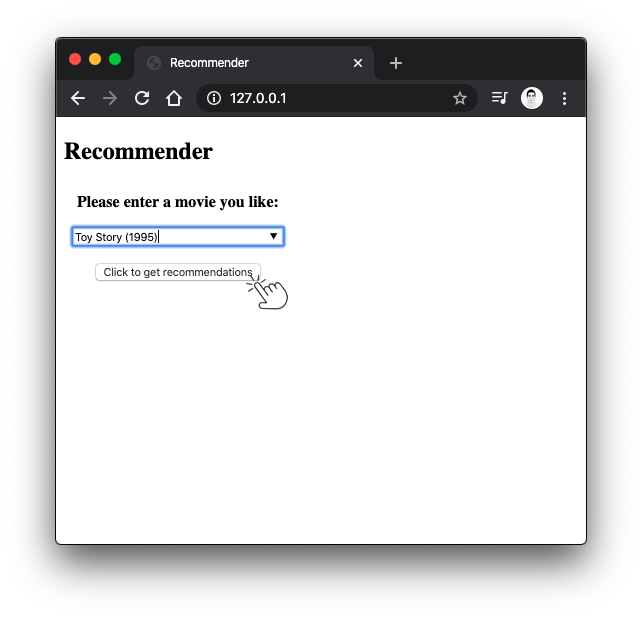
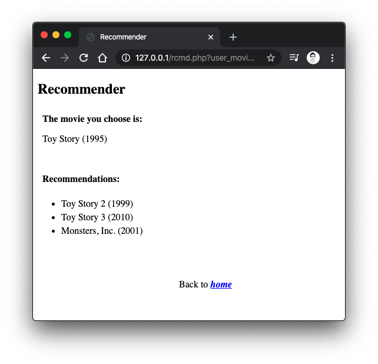
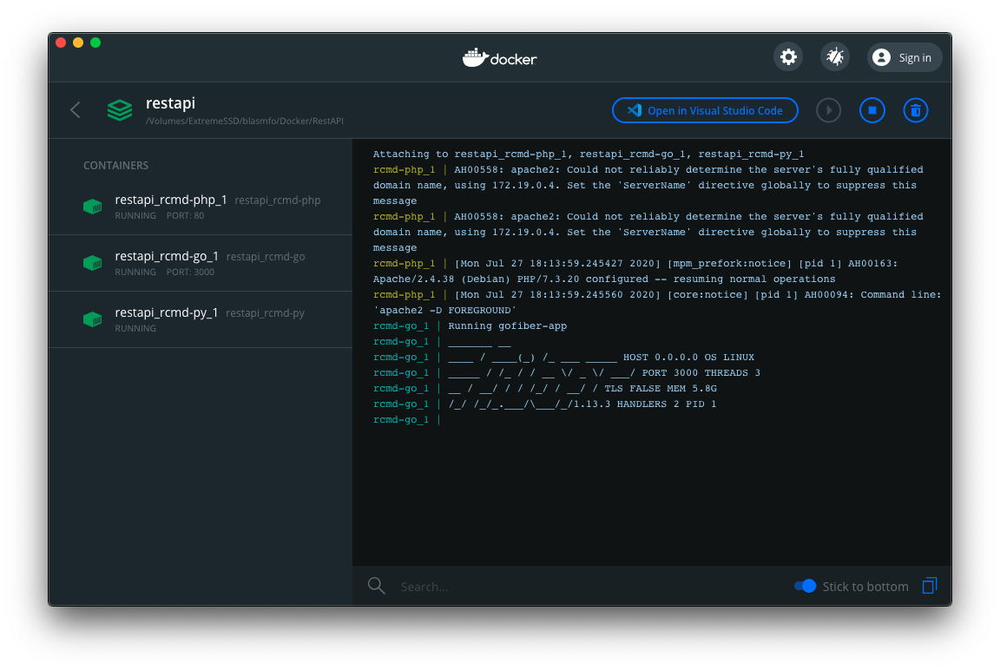
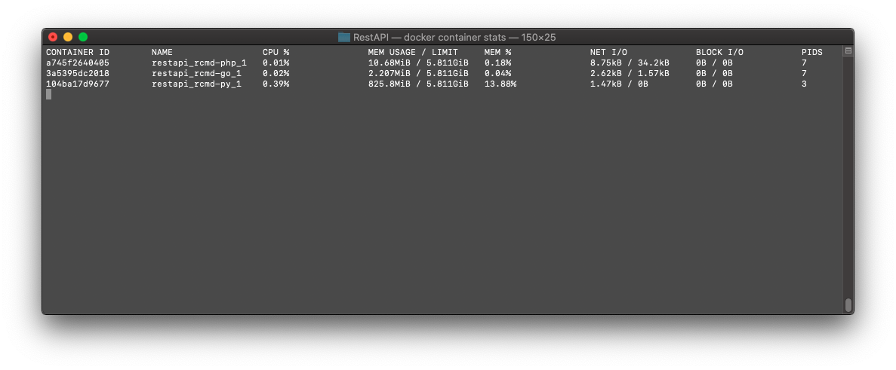

# Simple Movie Recommender System

This is a Movie Recommender System build with Docker (20.10), using Python (3.6) for the recommender algorithm, Golang (1.15) for the Rest API and PHP (7.3) for the web interface. The project is a showcase of a simple web app to show how to deploy a Docker app, in which containers interact with each other, with just a few steps in every machine you want.

## Interface

Some screenshots of the web app:

* <i>Open your localhost on port 80 and enter a movie or select it from the list</i>

* <i>Click to get the recommendations</i>

* <i>Check the list of recommendations</i>

## Docker side

Some screenshots of the Docker side of the app:

* <i>Deployed containers</i>

* <i>Some stats of the microservices</i>
